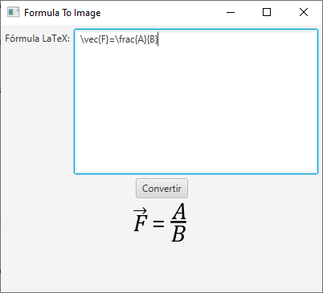

# Formula To Image

Convierte una fórmula en LaTeX a imagen:



El fragmento de código que se ejecuta cuando se pulsa el botón y convierte la fórmula LaTeX en una imagen es el siguiente:

```java
public static Image formulaToImage(String formula, int size, Color forecolor) 
    throws IOException {
    
    // crea una sesión de Snuggle
    SnuggleSession session = new SnuggleEngine().createSession();
    
    // parsea la fórmula (los delimitadores $$ indican que se trata de una fórmula)
    SnuggleInput input = new SnuggleInput("$$" + formula + "$$");
    session.parseInput(input);
    
    // crea el layout para dar tamaño de fuente y color a la imagen
    LayoutContext layout = new StyleAttributeLayoutContext(
        LayoutContextImpl.getDefaultLayoutContext(), 
        size + "pt", 
        forecolor
    );
    
    // renderiza la fórmula
    BufferedImage renderedImage = Converter.getInstance().render(
        session.buildDOMSubtree().item(0), 
        layout
    );
    
    // adapta la imagen para JavaFX
    return SwingFXUtils.toFXImage(renderedImage, null);		
}
```

Utiliza [**SnuggleTex**](https://www2.ph.ed.ac.uk/snuggletex) y [**JEuclid**](http://jeuclid.sourceforge.net/) para renderizar la fórmula LaTeX. Las dependencias Maven utilizadas son las siguientes:

```xml
<dependency>
    <groupId>de.rototor.snuggletex</groupId>
    <artifactId>snuggletex-core</artifactId>
    <version>1.3.0</version>
</dependency>
<dependency>
    <groupId>de.rototor.snuggletex</groupId>
    <artifactId>snuggletex-upconversion</artifactId>
    <version>1.3.0</version>
</dependency>
<dependency>
    <groupId>de.rototor.snuggletex</groupId>
    <artifactId>snuggletex-jeuclid</artifactId>
    <version>1.3.0</version>
</dependency>
```

